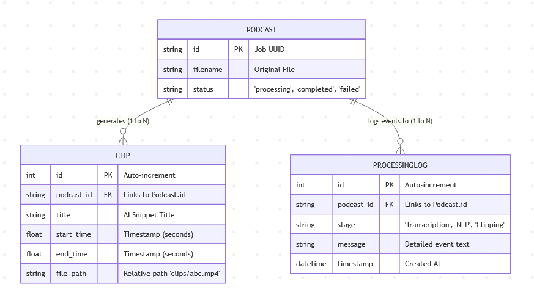

1. Environment Setup
```powershell
# Create and activate virtual environment
python -m venv .venv
.\.venv\Scripts\activate

# Install from requirements file
pip install -r requirements.txt

# Download the spaCy NLP model
python -m spacy download en_core_web_sm
```

2. Execution (Run in 3 Terminals)
- Terminal 1: Redis Broker (Docker)
```
docker run -d -p 6379:6379 --name podcast-redis redis
```

- Terminal 2: AI Worker (Celery)
```
# Clear any pending tasks from previous runs
celery -A tasks purge -f

# Start the worker (Solo pool required for Windows)
celery -A tasks worker --loglevel=info --pool=solo
```
- Terminal 3: API Server (Uvicorn)
```
uvicorn main:app --reload
```


# Er Diagram

